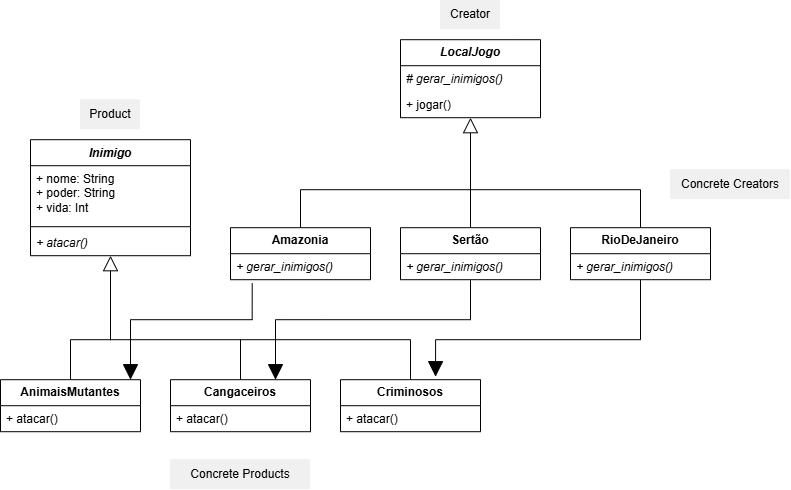

Este repositório contém a solução para a lista de exercícios de Padrões de Projeto Orientados a Objetos, demonstrando a aplicação do **Factory Method**.

## 📖 O Problema
O desafio consiste em projetar a arquitetura para um jogo de ação no Brasil, onde diferentes localizações (Amazônia, Sertão) instanciam inimigos específicos (Animais Mutantes, Cangaceiros). A estrutura deve garantir que o jogador sempre enfrente um inimigo, independentemente do cenário, e deve permitir a fácil expansão para novas fases (como o Rio de Janeiro com Criminosos) sem alterar a lógica principal do jogo.

## 🏗️ Modelagem da Solução

O diagrama de classes abaixo ilustra a aplicação do padrão para resolver o problema:



### Mapeamento do Padrão:
- **Product (`Inimigo`):** A classe base/interface de tudo que é criado. Define os atributos básicos (`nome`, `poder`, `vida`) e a ação principal que o inimigo executará (`atacar()`).
- **Concrete Products (`AnimaisMutantes`, `Cangaceiros`, `Criminosos`):** As implementações específicas de quem ataca o jogador em cada respectiva fase.
- **Creator (`LocalJogo`):** A classe base que declara o *Factory Method* (`gerar_inimigos()`). Ela gerencia o fluxo da fase através do método `jogar()`, mas delega a criação do obstáculo para as subclasses.
- **Concrete Creators (`Amazonia`, `Sertão`, `RioDeJaneiro`):** As classes que representam as fases. Elas implementam o método fábrica e instanciam o inimigo correto daquela região.

## 🚀 Como Executar

O projeto é simples e não requer gerenciadores de dependência externos. Para compilar e rodar a simulação via terminal:

1. Navegue até o diretório onde as classes foram criadas.
2. Compile os arquivos:
   ```bash
   javac *.java